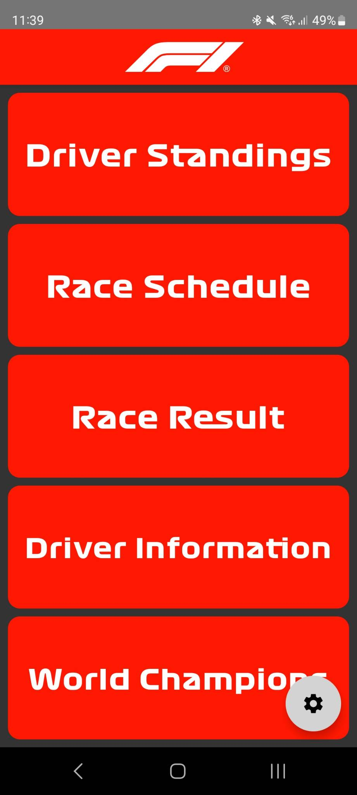
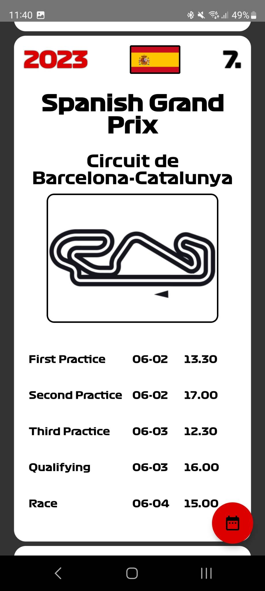
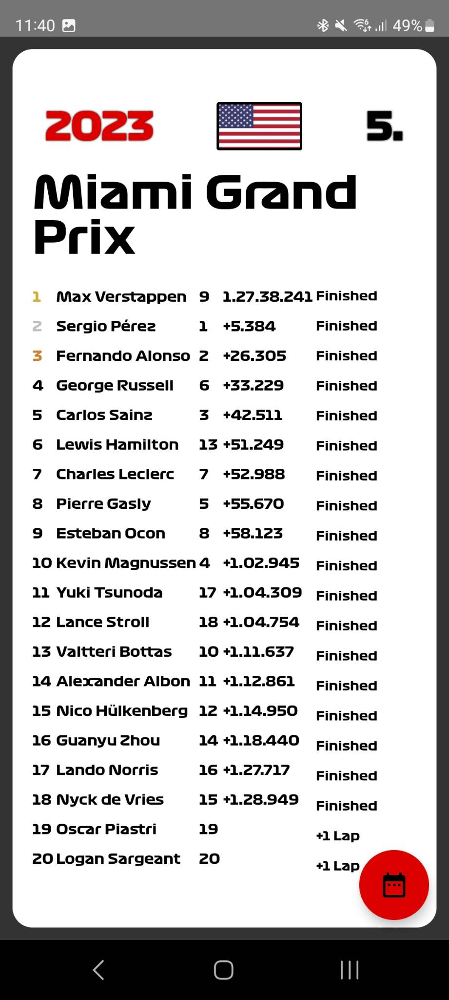
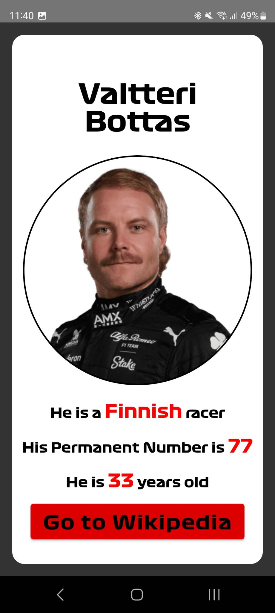

# Formula 1 FE

### This is a Formula One app that displays various information about the current Formula One season, including driver standings, race schedules, race results, driver information, and world champions. The app is built using Kotlin and Jetpack Compose for the UI.

## Features

Fetches data from a Formula One API
Displays driver standings
Shows race schedules and results
Provides driver information and world champions
Handles navigation between different screens
Sends notifications for race start times

## Dependencies

-   Jetpack Compose
-   Kotlin Coroutines
-   Retrofit for API calls

## How to use

Clone the repository and open the project in Android Studio.
Build and run the app on an Android device or emulator.
Navigate through the app using the bottom navigation bar to access different features.

# Interesting solutions

## MainActivity

The MainActivity class is the main entry point of the app. It initializes the necessary components, such as the NotificationManager, FormulaRepository, and mutable states for storing fetched data. It also sets up the navigation for the app using Jetpack Compose's NavHost and rememberNavController.

## GlideImage

In my project, I chose to use GlideImage because it offers a seamless and visually appealing way to display images from various sources. Its beautiful loading animations keep users engaged while waiting for images to load, and its efficient error handling ensures that the application remains stable and user-friendly even when encountering issues with image sources. GlideImage's ease of use and powerful features made it the perfect choice for enhancing the overall user experience in my project.

## fetchData

The fetchData function is responsible for fetching data from the Formula One API using the FormulaRepository. It fetches driver standings, race schedules, race results, driver information, and world champions. The fetched data is stored in mutable states, which are then passed to the corresponding screens.

## setupNavigation

The setupNavigation function sets up the navigation for the app using Jetpack Compose's NavHost and rememberNavController. It defines the routes for each screen and passes the necessary data to them.

## Formula One API Client

I created the Formula One API Client to simplify the process of fetching and displaying Formula One data in my Android project. The main goal was to provide an easy-to-use library that allows developers to access a wealth of Formula One information, such as driver standings, race schedules, and championship details, with minimal effort.

To achieve this, I utilized Retrofit, a powerful and efficient networking library for Android, which handles API requests and manages the underlying HTTP connections. Retrofit's seamless integration with Gson, a JSON parsing library, made it an ideal choice for parsing the JSON responses from the Ergast Formula One API.

The implementation process involved defining the API endpoints and their corresponding request methods in the GetFormulaDriverStandingsApi interface. I then created the FormulaRepository class, which serves as a repository for fetching data from the API. This class handles the API calls using the Retrofit instance and returns the parsed data to be used in the application.

By creating the Formula One API Client, I was able to streamline the process of fetching and displaying Formula One data in my project, providing an engaging and informative experience for users. The use of Retrofit and Gson ensured that the library is efficient, reliable, and easy to integrate into any Android project.

## createNotificationChannel

The createNotificationChannel function creates a notification channel for race start notifications. It is called in the onCreate method of the MainActivity.

## requestNotificationAccess

The requestNotificationAccess function requests notification access from the user. If the access is granted, it shows a notification using the showNotification function.

## showNotification

The showNotification function uses the NotificationHelper class to show a race start notification. In the helper class I have set the icon, message and priority for the notification.

## Screens

The app consists of several screens, including:

-   HomeScreen - The start screen. Here users can select from the following screens. 
-   DriverStandingsScreen - Displays the current driver standings, users can change the year from the floating action button.
-   RaceScheduleScreen - At default it displays the next event and its schedule. Users can swipe up or down to go from one race schedule to another. Here users can select from the past race schedules back to 2005. 
-   RaceResultScreen - At default it displays the latest event's result. Users can swipe from left to right between races and can can change the year from the floating action button. 
-   DriverInformationScreen - Displays the current grid. Year can be changed from the floating action button. Drivers are clickable.
-   DriverDetailsScreen - If the users selects a driver this screen will pop up with the correct information. User can navigate to the rigth Wikipedia site with a click. 
-   WorldChampionsScreen - Displays all of the driver champions. Profiles are clickable and they will redirect to the Wikipedia site.
-   SettingsScreen - Just there to simulate a notification.

Each screen displays different information related to the Formula One season and allows the user to select the desired year using the floating action button.
